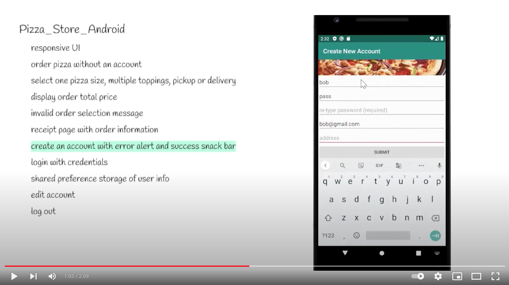

# Pizza_Store_Android
Mobile Android application created in a course at Humber College. Used for a final project, this app provides an intermediate level of a pizza ordering service.

## Features
responsive UI
order pizza without an account
select one pizza size, multiple toppings, pickup or delivery
display order total price
warning and success alerts everywhere
receipt page with order information
create an account
login with credentials
shared preference storage of user info
edit account
log out

## Demo

